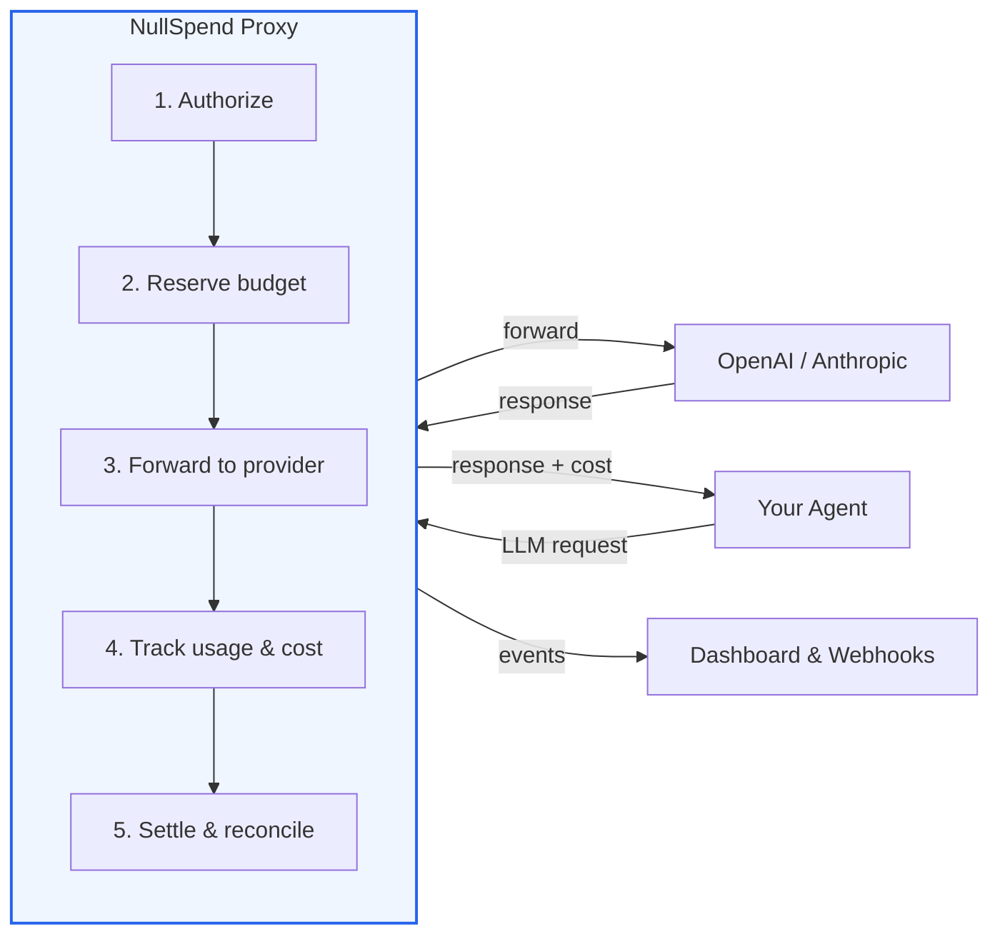
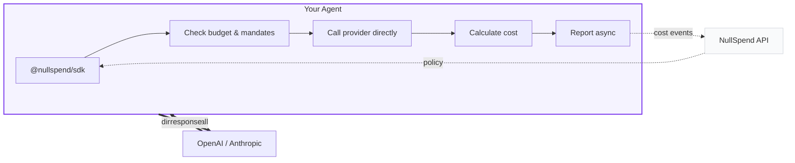

<p align="center">
  <h1 align="center">NullSpend</h1>
  <p align="center">
    <strong>AI cost monitoring, customer margin tracking, and budget enforcement.</strong>
    <br />
    Open-source FinOps platform with a proxy, TypeScript SDK, and Python SDK.
  </p>
</p>

<p align="center">
  <a href="https://github.com/NullSpend/nullspend/actions"></a>
  <a href="https://github.com/NullSpend/nullspend/blob/main/LICENSE"></a>
  <a href="https://www.npmjs.com/package/@nullspend/sdk"></a>
  <a href="https://nullspend.dev/docs"></a>
</p>

---

Track every dollar your AI agents spend. Know which customers are profitable. Stop runaway costs before they hit your bill.

NullSpend is the FinOps platform for AI-native companies: **cost monitoring**, **per-customer margin tracking** (via Stripe), **real-time budget enforcement**, and **human-in-the-loop approval**. Two integration paths — a **proxy** for zero-code enforcement, and **SDKs** (TypeScript + Python) for direct provider calls with client-side tracking.

```
# Proxy — one env var, guaranteed enforcement
OPENAI_BASE_URL=https://proxy.nullspend.dev/v1

# SDK — wrap your existing client, no proxy needed
openai = OpenAI(http_client=ns.openai)
```

## What NullSpend Does

**See where the money goes.** Real-time cost analytics across every LLM call — by model, provider, customer, team, or any tag. Daily trends, session replay, CSV export.

**Know if you're making money.** Connect Stripe and see per-customer gross margins in real time. Health tiers (Healthy / At Risk / Critical), 3-month trajectory projections, and Slack alerts when margins worsen. If you bill customers for AI features, this tells you which ones are profitable.

**Stop runaway spend.** Pre-request budget enforcement — spend is checked and reserved before the LLM call executes, not reconciled after. Velocity circuit breakers detect and halt spend anomalies automatically. Sub-millisecond overhead.

**Control what agents can do.** Model and provider mandates, tag-level budgets, session spend caps, and human-in-the-loop approval for high-stakes actions. One budget governs LLM calls and MCP tool calls together.

NullSpend provides:

- **Cost monitoring** — real-time spend tracking, model/provider/customer breakdowns, session replay
- **Stripe margin tracking** — per-customer profitability with auto-matching, health tiers, and trajectory alerts
- **Pre-request budget enforcement** — atomic reservation-based spend control, not after-the-fact notifications
- **Model & provider mandates** — restrict which models each API key can access
- **Velocity circuit breakers** — automatically detect and halt runaway spend patterns
- **Tag-level budgets** — enforce spend limits per customer, team, or any dimension you tag
- **Session governance** — cap total spend per agent conversation
- **Human-in-the-loop approval** — propose actions, wait for human decision, execute on approval
- **Webhook & Slack alerts** — 18 event types for budget thresholds, velocity spikes, margin changes
- **Unified LLM + MCP budgets** — one budget governs API calls and tool calls together

## Get Started in 2 Minutes

### OpenAI

```typescript
import OpenAI from "openai";

const openai = new OpenAI({
  baseURL: "https://proxy.nullspend.dev/v1",
  defaultHeaders: { "X-NullSpend-Key": process.env.NULLSPEND_API_KEY },
});

// Every call is now authorized, tracked, and enforced. Your code doesn't change.
const response = await openai.chat.completions.create({
  model: "gpt-4o",
  messages: [{ role: "user", content: "Hello" }],
});
```

### Anthropic

```typescript
import Anthropic from "@anthropic-ai/sdk";

const anthropic = new Anthropic({
  baseURL: "https://proxy.nullspend.dev/v1",
  defaultHeaders: { "X-NullSpend-Key": process.env.NULLSPEND_API_KEY },
});
```

### Claude Agent SDK

```typescript
import { withNullSpend } from "@nullspend/claude-agent";

const agent = new Agent({
  client,
  model: "claude-sonnet-4-6",
  ...withNullSpend({
    apiKey: process.env.NULLSPEND_API_KEY,
    tags: { agent: "research-bot", customer: "acme-corp" },
  }),
});
```

### TypeScript SDK

```typescript
import OpenAI from "openai";
import { NullSpend } from "@nullspend/sdk";

const ns = new NullSpend({
  baseUrl: "https://nullspend.dev",
  apiKey: process.env.NULLSPEND_API_KEY,
  costReporting: {},
});

const openai = new OpenAI({ fetch: ns.createTrackedFetch("openai") });
```

### Python SDK

```python
from openai import OpenAI
from nullspend import NullSpend

ns = NullSpend(api_key="ns_live_sk_...", cost_reporting={})

# Wrap OpenAI — costs tracked automatically, enforcement optional
openai = OpenAI(http_client=ns.openai)

response = openai.chat.completions.create(
    model="gpt-4o",
    messages=[{"role": "user", "content": "Hello"}],
)
```

## Choose Your Integration

Not every use case needs the same level of control. Pick the integration path that fits.

| Capability | Proxy | SDK | Claude Agent | MCP Server | MCP Proxy |
|---|:---:|:---:|:---:|:---:|:---:|
| Cost tracking | Yes | Yes | Yes | Yes | Yes |
| Tag-based cost attribution | Yes | Yes | Yes | — | Yes |
| Budget enforcement | Yes | Cooperative | Yes | — | Yes |
| Tag-level budget enforcement | Yes | Via proxy | Yes | — | — |
| Model & provider mandates | Yes | Cooperative | Yes | — | — |
| Velocity controls | Yes | Via proxy | Yes | — | — |
| Session limits | Yes | Cooperative | Yes | — | — |
| Request/response logging | Yes | — | Yes | — | — |
| HITL approval | Via SDK | Yes | Via SDK | Yes | Yes |
| MCP tool gating | — | — | — | Yes | Yes |
| Budget self-audit | — | Yes | Yes | Yes | — |

**Proxy** gives you full, guaranteed enforcement at the network level — nothing gets past it. **Claude Agent** routes through the proxy automatically, so it inherits every proxy capability. **SDK** gives you cooperative client-side enforcement with direct provider calls. All paths report to the same dashboard.

## How It Works

### Proxy Mode — guaranteed enforcement



Every request follows the same path: **authorize** the spend against your budget and mandates, **reserve** the estimated cost atomically, **forward** to the provider, **track** the actual token usage, **settle** the final cost. If the budget can't cover it — or the model isn't allowed — the request never leaves. Sub-millisecond enforcement overhead on the global edge via Cloudflare Workers and Durable Objects.

### SDK Mode — direct calls with client-side enforcement



Don't want to route traffic through a proxy? The SDK wraps your existing fetch call with `createTrackedFetch()`. With `enforcement: true`, it fetches your key's policy, checks budget, model mandates, and session limits **before** the request — throwing `BudgetExceededError`, `MandateViolationError`, or `SessionLimitExceededError` if the call would violate policy. Cost is calculated locally using the built-in pricing engine and reported asynchronously. Your requests go directly to the provider.

> **Note:** SDK enforcement is cooperative — it runs client-side and can be bypassed by raw API calls. For guaranteed, un-bypassable enforcement, use the proxy.

## Platform Capabilities

### Cost Monitoring & Analytics
Real-time cost tracking across every LLM call with per-request token counts, model pricing, and microdollar precision. The dashboard surfaces daily spend trends, model/provider/key breakdowns, tag-based attribution, and CSV export. Group spend by API key, customer, team, or any custom tag — drill into any dimension to understand where money goes.

Session replay lets you trace an entire agent conversation: every request, every model, every cost, in order.

### Profitability Tracking (Stripe Margins)
Connect your Stripe account and see per-customer profitability in real time. NullSpend syncs invoices automatically, matches Stripe customers to your cost tags (by metadata or manual mapping), and calculates gross margins. Health tiers (Healthy / Moderate / At Risk / Critical) with 3-month trajectory projections and Slack alerts when margins worsen.

If you're billing customers for AI features, this answers the question: "Am I making money on each customer, or losing it?"

### Budget Authorization
Real-time, pre-request budget enforcement. Set spend limits per user, per API key, per customer, or per tag. If a request would exceed the limit, the proxy returns `429 budget_exceeded` without ever calling the upstream provider. Atomic reservation-based deductions with sub-millisecond latency. Three enforcement policies: `strict_block` (deny), `soft_block` (log but allow), `warn` (track only). Period resets (daily/weekly/monthly/yearly) and customizable threshold alerts (50%, 80%, 90%, 95%).

### Model & Provider Mandates
Restrict which models and providers each API key can access. An agent with a key mandated to `gpt-4o-mini` only will be blocked from calling `gpt-4o` — before the request executes. The SDK also enforces mandates client-side and includes a `cheapest_overall` recommendation from the policy endpoint.

### Velocity Controls
Sliding-window spend velocity detection. When an agent starts burning money faster than normal, the circuit breaker trips automatically. Configurable window size and cooldown period. Triggers `velocity.exceeded` and `velocity.recovered` webhooks. Recovers automatically when the anomaly subsides.

### Session Governance
Cap total spend per agent session. If a single request would push the session over its limit, it's blocked — the agent is forced to stop or escalate. Track per-session spend across multiple requests for conversation-level cost control.

### Customer Attribution
Tag requests with customer IDs for per-customer cost tracking and profitability analysis. Combined with Stripe margins, you get a complete picture: what each customer pays you, what they cost you, and whether the unit economics work.

### Human-in-the-Loop Approval
Propose high-stakes actions — sending emails, calling external APIs, writing to production databases — and wait for human approval before execution. Full SDK support (TypeScript + Python) with polling, timeouts, and lifecycle tracking. Budget increase negotiation: agents can request more budget, humans approve or reject from the dashboard or Slack.

### Request & Response Logging
Capture full request/response bodies for audit, compliance, and debugging. Supports streaming and non-streaming. Retrieve stored bodies via the API for post-hoc analysis. (Pro/Enterprise)

### Webhook & Slack Alerts
18 event types with HMAC-SHA256 signed delivery. Budget threshold warnings, velocity spikes, session limit breaches, HITL action notifications, margin alerts — all routable to webhooks, Slack, or any HTTP endpoint.

### Unified LLM + MCP Budgets
One budget governs API calls and tool calls together. Gate MCP tool calls through approval workflows with `@nullspend/mcp-proxy`, or expose budget awareness directly to agents with `@nullspend/mcp-server` — including self-audit tools so agents can check their own spend.

### Cost Engine
47 models across OpenAI and Anthropic — bundled in both TypeScript and Python SDKs:

- **OpenAI** (23 models) — GPT-5.4, GPT-5.3, GPT-5, GPT-4.1, GPT-4o, o3, o4-mini, and more
- **Anthropic** (22 models) — Claude Opus 4.6, Sonnet 4.6, Haiku 4.5, plus all dated variants
- **Google** (2 models, pricing only) — Gemini 2.5 Pro, Gemini 2.5 Flash

Proxy routes OpenAI and Anthropic. Google pricing is in the catalog for SDK-side cost calculation (direct mode). Accurate token-to-cost math with cached tokens, reasoning tokens (o-series), and Anthropic cache write tiers.

### Teams & Organizations
Multi-org support with role-based access (Owner, Admin, Member, Viewer). Invite team members, manage API keys per org, audit log for all changes. Separate billing per org with Free and Pro tiers.

## Packages

| Package | Description |
|---|---|
| [`apps/proxy`](apps/proxy/) | Cloudflare Workers proxy — budget authorization, mandates, cost tracking, velocity controls, session limits, webhooks, request logging, streaming |
| [`@nullspend/sdk`](packages/sdk/) | TypeScript SDK — tracked fetch with client-side enforcement, cost reporting, HITL approval workflows, budget & spend queries |
| [`nullspend`](packages/sdk-python/) | Python SDK — full feature parity with the TypeScript SDK |
| [`@nullspend/cost-engine`](packages/cost-engine/) | Pricing catalog and cost calculation for 47 models (OpenAI, Anthropic, Google) |
| [`@nullspend/claude-agent`](packages/claude-agent/) | Claude Agent SDK adapter — `withNullSpend()` and `withNullSpendAsync()` for budget-aware agents |
| [`@nullspend/mcp-server`](packages/mcp-server/) | MCP server — approval tools, budget queries, spend summaries, and cost event listing for any MCP client |
| [`@nullspend/mcp-proxy`](packages/mcp-proxy/) | MCP proxy — gate tool calls through approval before forwarding to upstream servers |
| [`@nullspend/docs`](packages/docs-mcp-server/) | MCP server that serves NullSpend docs to AI coding tools |
| [`@nullspend/db`](packages/db/) | Drizzle ORM schema and types |

## Hosted Platform

The open-source packages handle authorization, enforcement, and cost tracking. The [hosted platform at nullspend.dev](https://nullspend.dev) adds:

- **Cost analytics** — daily spend trends, model/provider/key/tag breakdowns, CSV export
- **Profitability dashboard** — Stripe margins, per-customer health tiers, trajectory projections
- **Budget management** — create/edit budgets with thresholds, policies, and period resets
- **Session replay** — trace agent conversations with per-request cost breakdown
- **HITL inbox** — approve/reject agent actions from the dashboard or Slack
- **Webhook configuration** — manage endpoints, event filters, payload modes, secret rotation
- **Team management** — multi-org, role-based access, audit log
- **Request logging** — full request/response body capture and retrieval (Pro/Enterprise)

## Proxy Endpoints

| Endpoint | Provider |
|---|---|
| `POST /v1/chat/completions` | OpenAI |
| `POST /v1/messages` | Anthropic |

Streaming and non-streaming. Your provider API key forwards transparently.

## Development

```bash
git clone https://github.com/NullSpend/nullspend.git && cd nullspend
pnpm install

# Build (dependency order)
pnpm db:build && pnpm cost-engine:build && pnpm sdk:build

# Test
pnpm proxy:test         # Proxy worker tests
pnpm sdk:test           # SDK tests
pnpm cost-engine:test   # Cost engine tests
pnpm claude-agent:test  # Claude agent adapter tests
pnpm mcp:test           # MCP server tests
pnpm mcp-proxy:test     # MCP proxy tests
pnpm db:test            # DB schema tests
pnpm docs-mcp:test      # Docs MCP tests
pnpm sdk-python:test    # Python SDK tests (requires Python 3.9+)
```

See [CONTRIBUTING.md](CONTRIBUTING.md) for the full guide.

## Documentation

- [Overview](docs/overview.md)
- [Quick Start — OpenAI](docs/quickstart/openai.md)
- [Quick Start — Anthropic](docs/quickstart/anthropic.md)
- [API Reference](docs/api-reference/overview.md)
- [Webhooks](docs/webhooks/overview.md)
- [Full docs at nullspend.dev](https://nullspend.dev/docs)

## License

Apache-2.0 — see [LICENSE](LICENSE).
