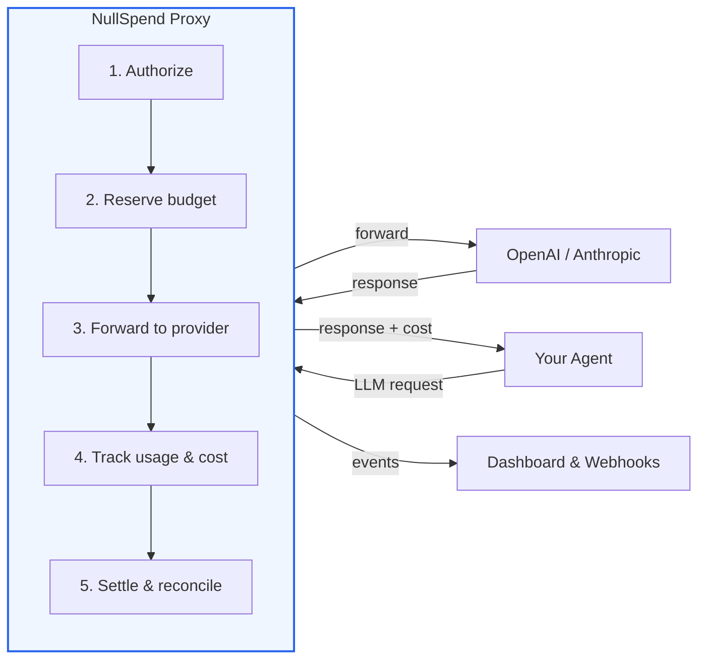
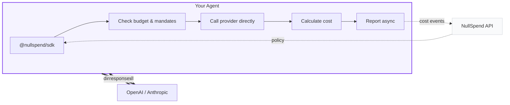

<p align="center">
  <h1 align="center">NullSpend</h1>
  <p align="center">
    <strong>AI cost monitoring, customer margin tracking, and budget enforcement.</strong>
    <br />
    Open-source FinOps platform with a proxy, TypeScript SDK, and Python SDK.
  </p>
</p>

<p align="center">
  <a href="https://github.com/NullSpend/nullspend/actions"></a>
  <a href="https://github.com/NullSpend/nullspend/blob/main/LICENSE"></a>
  <a href="https://www.npmjs.com/package/@nullspend/sdk"></a>
  <a href="https://nullspend.dev/docs"></a>
</p>

---

Track every dollar your AI agents spend. Know which customers are profitable. Stop runaway costs before they hit your bill.

NullSpend is the FinOps platform for AI-native companies: **cost monitoring**, **per-customer margin tracking** (via Stripe), **real-time budget enforcement**, and **human-in-the-loop approval**. Two integration paths — a **proxy** for zero-code enforcement, and **SDKs** (TypeScript + Python) for direct provider calls with client-side tracking.

```
# Proxy — one env var, guaranteed enforcement
OPENAI_BASE_URL=https://proxy.nullspend.dev/v1

# SDK — wrap your existing client, no proxy needed
openai = OpenAI(http_client=ns.openai)
```

### Built for teams who

- **Bill customers for AI features** and need to know per-customer margins before the monthly surprise
- **Deploy autonomous agents** that spend money without a human watching every call
- **Run multi-model, multi-provider stacks** and want a single pane of glass for cost and control
- **Need to explain AI spend** to finance, leadership, or investors with real attribution data

## Per-Customer Margins (Stripe Integration)

If you bill customers for AI features, the first question is: **am I making money on each one?**

Connect Stripe and NullSpend answers it automatically:

| Customer | Revenue | AI Cost | Margin | Health |
|---|---|---|---|---|
| Acme Corp | $2,400/mo | $890/mo | 62.9% | Healthy |
| Beta Inc | $800/mo | $1,240/mo | -55.0% | Critical |
| Gamma Ltd | $1,600/mo | $1,120/mo | 30.0% | Moderate |

- **Auto-sync** — invoices pulled from Stripe every 2 hours (last 3 months + current)
- **Auto-match** — Stripe customers matched to NullSpend cost tags by metadata or customer ID
- **Health tiers** — Healthy (50%+), Moderate (20-49%), At Risk (0-19%), Critical (negative)
- **Trajectory** — 3-month sparkline with linear regression, Slack alerts when a customer's margin drops a tier
- **Per-customer detail** — drill into any customer to see revenue over time, model breakdown, and cost drivers

Manual mapping for customers that don't auto-match. CSV export for the full margin table.

## Cost Monitoring & Analytics

Real-time cost tracking across every LLM call — by model, provider, customer, team, or any tag you define. The dashboard shows daily spend trends, model/provider/key breakdowns, tag-based attribution, and session replay. Export to CSV.

Tag requests with `X-NullSpend-Tags` (proxy) or pass `tags` in the SDK to attribute costs to customers, teams, features, or environments. Break down spend by any dimension.

## Budget Enforcement & Controls

**Stop runaway spend.** Pre-request budget enforcement — spend is checked and reserved before the LLM call executes, not reconciled after. Velocity circuit breakers detect and halt spend anomalies automatically. Sub-millisecond overhead.

**Control what agents can do.** Model and provider mandates, tag-level budgets, session spend caps, and human-in-the-loop approval for high-stakes actions. One budget governs LLM calls and MCP tool calls together.

### At a glance

- **Budgets** — per-user, per-key, per-customer, per-tag spend limits with `strict_block` / `soft_block` / `warn` policies
- **Mandates** — restrict which models and providers each API key can access
- **Velocity controls** — sliding-window circuit breaker for spend rate anomalies
- **Session limits** — cap total spend per agent conversation
- **HITL approval** — propose high-stakes actions, wait for human decision, execute on approval
- **Budget negotiation** — agents can request budget increases that humans approve from dashboard or Slack
- **Webhook & Slack alerts** — 18 event types for thresholds, velocity spikes, margin changes, HITL actions
- **Period resets** — daily, weekly, monthly, or yearly automatic budget resets

## Get Started

Pick one. All paths report to the same dashboard.

### Option 1: Proxy (zero-code, guaranteed enforcement)

Point your provider SDK at the proxy. Every call is tracked, budgeted, and enforced. Your code doesn't change.

```typescript
// TypeScript — OpenAI
const openai = new OpenAI({
  baseURL: "https://proxy.nullspend.dev/v1",
  defaultHeaders: { "X-NullSpend-Key": process.env.NULLSPEND_API_KEY },
});

// TypeScript — Anthropic
const anthropic = new Anthropic({
  baseURL: "https://proxy.nullspend.dev/v1",
  defaultHeaders: { "X-NullSpend-Key": process.env.NULLSPEND_API_KEY },
});
```

```python
# Python — OpenAI
openai = OpenAI(
    base_url="https://proxy.nullspend.dev/v1",
    default_headers={"X-NullSpend-Key": os.environ["NULLSPEND_API_KEY"]},
)
```

### Option 2: SDK (direct calls, client-side tracking)

Wrap your provider client. Costs are calculated locally and reported in the background. No proxy in the path.

```typescript
// TypeScript
import { NullSpend } from "@nullspend/sdk";

const ns = new NullSpend({ apiKey: process.env.NULLSPEND_API_KEY, costReporting: {} });
const openai = new OpenAI({ fetch: ns.createTrackedFetch("openai") });
```

```python
# Python
from nullspend import NullSpend

ns = NullSpend(api_key=os.environ["NULLSPEND_API_KEY"], cost_reporting={})
openai = OpenAI(http_client=ns.openai)
```

### Option 3: Claude Agent SDK

```typescript
import { withNullSpend } from "@nullspend/claude-agent";

const agent = new Agent({
  client,
  model: "claude-sonnet-4-6",
  ...withNullSpend({
    apiKey: process.env.NULLSPEND_API_KEY,
    tags: { agent: "research-bot", customer: "acme-corp" },
  }),
});
```

## Choose Your Integration

Not every use case needs the same level of control. Pick the integration path that fits.

| Capability | Proxy | SDK | Claude Agent | MCP Server | MCP Proxy |
|---|:---:|:---:|:---:|:---:|:---:|
| Cost tracking | Yes | Yes | Yes | Yes | Yes |
| Tag-based cost attribution | Yes | Yes | Yes | — | Yes |
| Budget enforcement | Yes | Cooperative | Yes | — | Yes |
| Tag-level budget enforcement | Yes | Via proxy | Yes | — | — |
| Model & provider mandates | Yes | Cooperative | Yes | — | — |
| Velocity controls | Yes | Via proxy | Yes | — | — |
| Session limits | Yes | Cooperative | Yes | — | — |
| Request/response logging | Yes | — | Yes | — | — |
| HITL approval | Via SDK | Yes | Via SDK | Yes | Yes |
| MCP tool gating | — | — | — | Yes | Yes |
| Budget self-audit | — | Yes | Yes | Yes | — |

**Proxy** gives you full, guaranteed enforcement at the network level — nothing gets past it. **Claude Agent** routes through the proxy automatically, so it inherits every proxy capability. **SDK** gives you cooperative client-side enforcement with direct provider calls. All paths report to the same dashboard.

## How It Works

### Proxy Mode — guaranteed enforcement



Every request follows the same path: **authorize** the spend against your budget and mandates, **reserve** the estimated cost atomically, **forward** to the provider, **track** the actual token usage, **settle** the final cost. If the budget can't cover it — or the model isn't allowed — the request never leaves. Sub-millisecond enforcement overhead on the global edge via Cloudflare Workers and Durable Objects.

### SDK Mode — direct calls with client-side enforcement



Don't want to route traffic through a proxy? The SDK wraps your existing fetch call with `createTrackedFetch()`. With `enforcement: true`, it fetches your key's policy, checks budget, model mandates, and session limits **before** the request — throwing `BudgetExceededError`, `MandateViolationError`, or `SessionLimitExceededError` if the call would violate policy. Cost is calculated locally using the built-in pricing engine and reported asynchronously. Your requests go directly to the provider.

> **Note:** SDK enforcement is cooperative — it runs client-side and can be bypassed by raw API calls. For guaranteed, un-bypassable enforcement, use the proxy.

## Supported Models

47 models with accurate token-to-cost calculation — cached tokens, reasoning tokens (o-series), Anthropic cache write tiers:

- **OpenAI** (23) — GPT-5.4, GPT-5.3, GPT-5, GPT-4.1, GPT-4o, o3, o4-mini, and more
- **Anthropic** (22) — Claude Opus 4.6, Sonnet 4.6, Haiku 4.5, plus all dated variants
- **Google** (2, pricing only) — Gemini 2.5 Pro, Gemini 2.5 Flash

Proxy routes OpenAI and Anthropic. Google pricing is in the catalog for SDK-side cost calculation.

## Packages

| Package | Description |
|---|---|
| [`apps/proxy`](apps/proxy/) | Cloudflare Workers proxy — budget authorization, mandates, cost tracking, velocity controls, session limits, webhooks, request logging, streaming |
| [`@nullspend/sdk`](packages/sdk/) | TypeScript SDK — tracked fetch with client-side enforcement, cost reporting, HITL approval workflows, budget & spend queries |
| [`nullspend`](packages/sdk-python/) | Python SDK — full feature parity with the TypeScript SDK |
| [`@nullspend/cost-engine`](packages/cost-engine/) | Pricing catalog and cost calculation for 47 models (OpenAI, Anthropic, Google) |
| [`@nullspend/claude-agent`](packages/claude-agent/) | Claude Agent SDK adapter — `withNullSpend()` and `withNullSpendAsync()` for budget-aware agents |
| [`@nullspend/mcp-server`](packages/mcp-server/) | MCP server — approval tools, budget queries, spend summaries, and cost event listing for any MCP client |
| [`@nullspend/mcp-proxy`](packages/mcp-proxy/) | MCP proxy — gate tool calls through approval before forwarding to upstream servers |
| [`@nullspend/docs`](packages/docs-mcp-server/) | MCP server that serves NullSpend docs to AI coding tools |
| [`@nullspend/db`](packages/db/) | Drizzle ORM schema and types |

## Hosted Platform

The open-source packages handle authorization, enforcement, and cost tracking. The [hosted platform at nullspend.dev](https://nullspend.dev) adds:

- **Cost analytics** — daily spend trends, model/provider/key/tag breakdowns, CSV export
- **Profitability dashboard** — Stripe margins, per-customer health tiers, trajectory projections
- **Budget management** — create/edit budgets with thresholds, policies, and period resets
- **Session replay** — trace agent conversations with per-request cost breakdown
- **HITL inbox** — approve/reject agent actions from the dashboard or Slack
- **Webhook configuration** — manage endpoints, event filters, payload modes, secret rotation
- **Team management** — multi-org, role-based access, audit log
- **Request logging** — full request/response body capture and retrieval (Pro/Enterprise)

## Proxy Endpoints

| Endpoint | Provider |
|---|---|
| `POST /v1/chat/completions` | OpenAI |
| `POST /v1/messages` | Anthropic |

Streaming and non-streaming. Your provider API key forwards transparently.

## Development

```bash
git clone https://github.com/NullSpend/nullspend.git && cd nullspend
pnpm install

# Build (dependency order)
pnpm db:build && pnpm cost-engine:build && pnpm sdk:build

# Test
pnpm proxy:test         # Proxy worker tests
pnpm sdk:test           # SDK tests
pnpm cost-engine:test   # Cost engine tests
pnpm claude-agent:test  # Claude agent adapter tests
pnpm mcp:test           # MCP server tests
pnpm mcp-proxy:test     # MCP proxy tests
pnpm db:test            # DB schema tests
pnpm docs-mcp:test      # Docs MCP tests
pnpm sdk-python:test    # Python SDK tests (requires Python 3.9+)
```

See [CONTRIBUTING.md](CONTRIBUTING.md) for the full guide.

## Documentation

- [Overview](docs/overview.md)
- [Quick Start — OpenAI](docs/quickstart/openai.md)
- [Quick Start — Anthropic](docs/quickstart/anthropic.md)
- [API Reference](docs/api-reference/overview.md)
- [Webhooks](docs/webhooks/overview.md)
- [Full docs at nullspend.dev](https://nullspend.dev/docs)

## License

Apache-2.0 — see [LICENSE](LICENSE).
